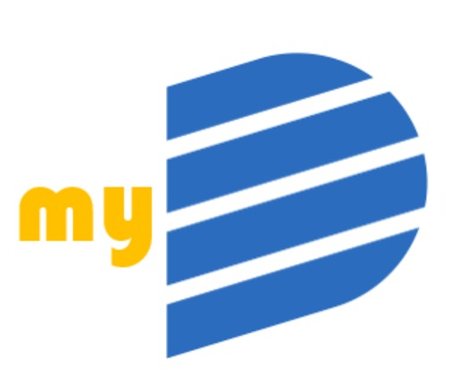
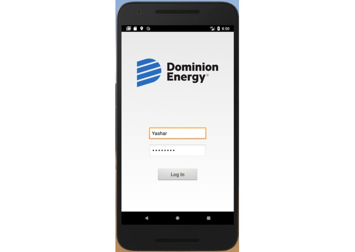
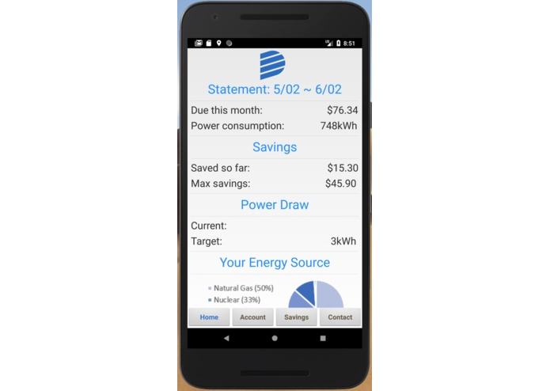
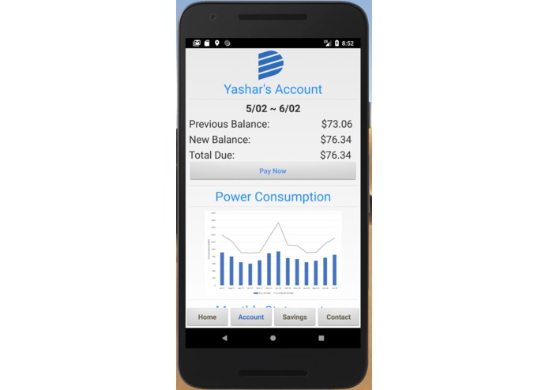
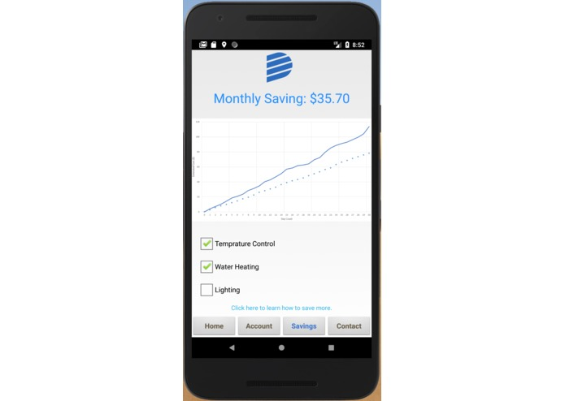
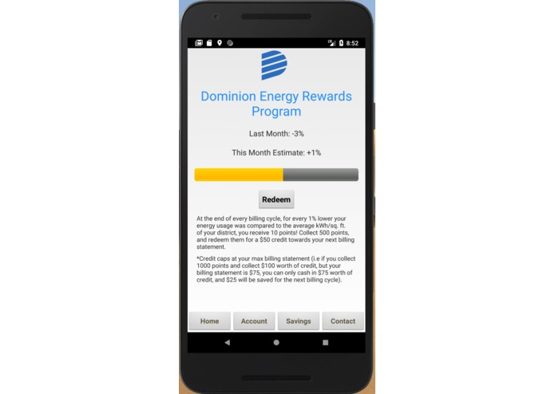
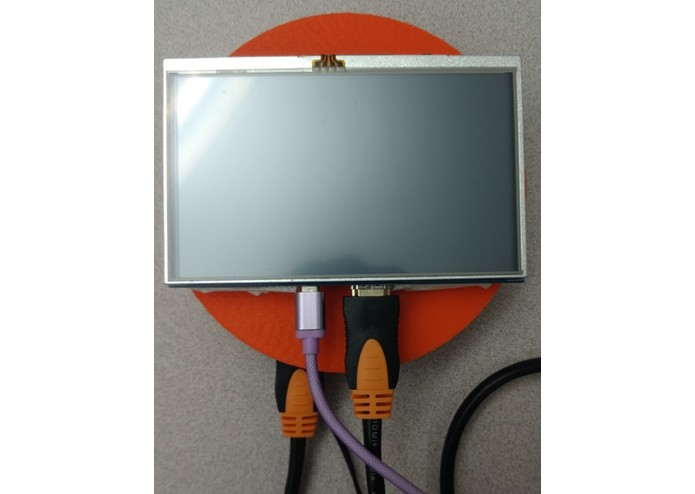
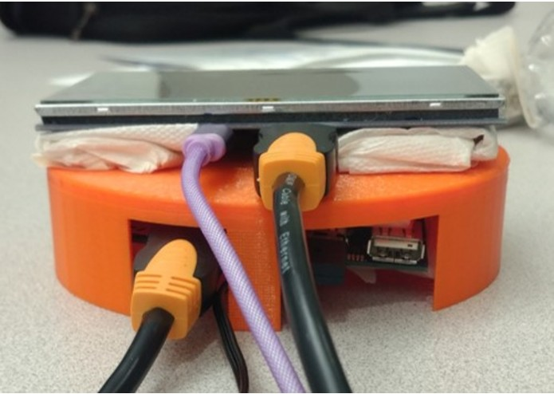

# myDominon

## Inspiration
The inspiration for our app came from the business model of other large tech companies. We wanted an app that kept the consumer’s interest in mind and imagined methods that would get us interested in something as seemingly mundane as an energy bill. We sought an app that did more than simply tell you how much you owed; we wanted an interactive app that could make users feel like they were in control of their energy bill and provided them opportunities to save money all while helping the environment (and Dominion’s bottom line).

The inspiration for our new PowerMe(ter) came from Dominion’s original prototype for a Smart Meter in homes and substations. However, our meters were designed with the intention for increased data collection to allow for greater optimization of power usage for the consumer, as well as more demographic information for Domiminion so as to better predict energy demand by consumers in an attempt to flatten their hourly and monthly demand curves.

## What it does
The myDominion app works to make bill payment more interactive, as well as increase customer interaction with Dominion Energy. The myDominion app features secure Log-In, a description of the user’s previous billing, a “Pay Now” feature, a graph demonstrating the user’s monthly energy consumption, as well as a breakdown of an estimation of where the user’s power is being supplied from (nuclear, coal, natural gas, etc.). The app allows users to see how much money they have saved over the billing cycle, as well as the maximum amount of savings they could have accumulated had they opted for all possible discounts. The next tab allows users to see a graph tracking their current estimated energy expenditures for the month. The user can then below select options that opt them in for energy discounts; participants can agree to keep their thermostat up 2 degrees during the summer or choose to keep their lights off during peak hours in order to lower their bill. The greater the amount of power saved, the greater the monthly savings, which is indicated at the top of the screen. The graph also adjusts to better visualize to the customer how these options affect their final bill payment. The app also allows for users to report potential blackouts; users can also attach a photo to provide Dominion with greater context of the situation on the ground.

The PowerMe(ter) works to provide Dominion with a more precise readout of an individual’s power consumption; that information includes the energy demand curve for that household, distribution of energy expenditure, as well as other demographic information. This information can then be used by Dominion to improve their Predictive Stocking capabilities and better adjust their power output to match that with the real-time demand of consumers, preventing power spikes and lowering operational costs, while also reducing costs for consumers. The meter also plays into our proposed Dominion Rewards program for the app; at the end of every billing cycle, for every 1% lower their energy usage as compared to the average kWh/sq. ft. of their district, the consumer receives 10 points 500 points may then be redeemed for a $50 credit towards their next billing statement. This incentivizes customers to participate in more opt-in programs, as well as constantly monitor their energy output in order to make the necessary adjustments. Increased app usage and interaction increase customer interaction and loyalty with Dominion.

## How it's built
We used Android Studio to create a Kotlin based native Android app. It utilizes Firebase and Google Cloud to get and store real-time power data from the PowerMe(ter). On Dominion’s side, this application will collect real-time and temporal user data such as average power usage to better predict peak time usage and when to shut down or reactivate a power plant. The PowerMe(ter) was constructed using a Qualcomm DragonBoard 410c, Arduino 101, Python script, breadboard, and resistors. The encasing for the meter was modeled in SolidWorks and 3D printed with a MakerBot Replicator.

## What's next
Our next goal is to tweak and perfect the PowerMe(ter) to collect other types of power data, as well as lower the cost of production by finding cheaper parts that can still fulfill the same function. We also want to implement machine learning into a future algorithm that analyzes the results of all these PowerMe(ter)s, and can develop a demand curve model for Dominion that optimized energy production and consumption for that district. We also want to continue work on our app to enhance its UI, as well as develop other reward programs, opt-in incentives, and other methods of increasing Dominion and customer interaction beyond just paying the bill.

## Application

## Hardware

